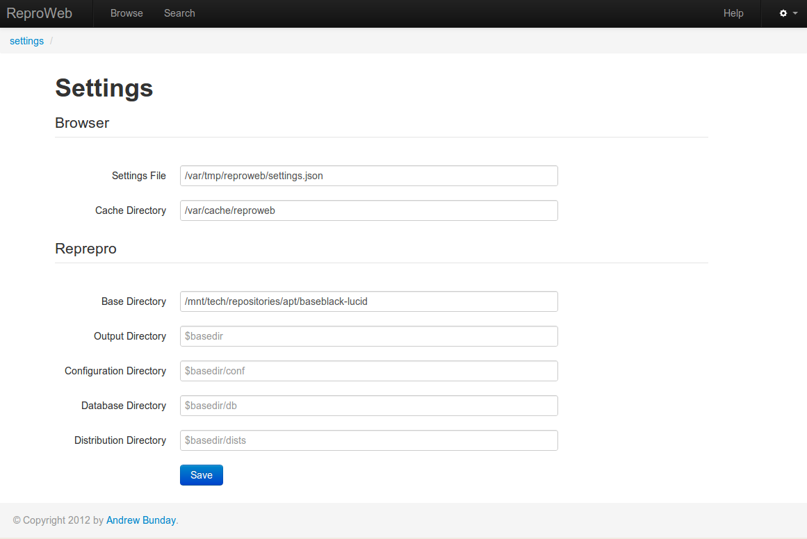

## Getting started

This document demonstrates the installation, setup and usage of the app.

### Requirements

1.    A debian/ubuntu based system which has the following packages installed:
 
     * __reprepro__ - Debian package repository producer
     * __python-debian__ - Python modules to work with Debian-related data formats
     * __libev3__ - high-performance event loop library modelled after libevent
       
1.   Sudo or _(ick root access)_ if you choose to write the cache files to their preconfigured
     path in /var/cache. 

### Installation

1.    Download the latest tarball out of github from 
      [here](https://github.com/baseblack/zenoss-nexmo/tarball/master). Extract it into the 
      location you want to run your install from. For the remainder of this 

1.    Next, download the most up to date version of 
      [reprocheep](http://github.com/andrewbunday/repocheep). 
      Reepocheep is the module which provides an interface to reprepro and dpkg which the webapp
      uses. Drop the reprocheep file into the 3rdParty/python folder, or add it somewhere on 
      your PYTHONPATH.

1.    Decide on your configuration file. The file `reproweb/default_settings.py` contains the default 
      settings which the app will try to use when it starts up. 

      You can either choose to:

    * Edit this file directly
    * Create a new file and inform the webapp to use it by setting the environment variable - 

            REPROWEB_SETTINGS=/path/to/my/settings_file

1.    Settings which you can change the defaults of are:

        DEBUG = False

        # Application Settings
        APP_NAME =  'ReproWeb'  
        APP_SETTINGSFILE = '/var/tmp/reproweb/settings.json'
        APP_CACHEPATH = '/var/cache/reproweb'
        APP_BASEDIR = '/mnt/tech/repositories/apt/auto-lucid'

        # WSGI Settings
        SERVER_PORT = 5000

### Running the App

1.    Included with the app are two run scripts. 

      * `debug-run.py` will use Flask's native WSGI server to 
      serve requests. It's handy to use this when you need to debug something since it will provide lots
      of console output and an interactive error page if a view fails.

      * `fapws3-run.py` uses the Fast Asynchorous Python Web Server to handle requests on behalf of Flask.
      Its generally more stable than flask's server and can handle far more concurrent interactions.

1.    Choose one of the run scripts and start it up from the commandline.

        $ python debug-run.py
           * Running on http://0.0.0.0:5000/
           * Restarting with reloader

1.    Open up a web browser navigating to the localhost, or whatever server you are using.

       

1.    When the app runs for the first time it will try to load its settings from disk. 
      The settings are saved in a json file which holds a serialized version of the default configuration 
      as well as any additional settings we add to the app or which are generated during setup.

      If the app cannot load the settings, because the file doesn't exist it will redirect straight to the
      settings page; 

      eg. `http://localhost:5000/settings`.

      

